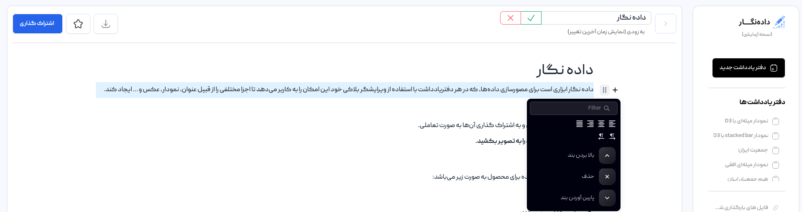
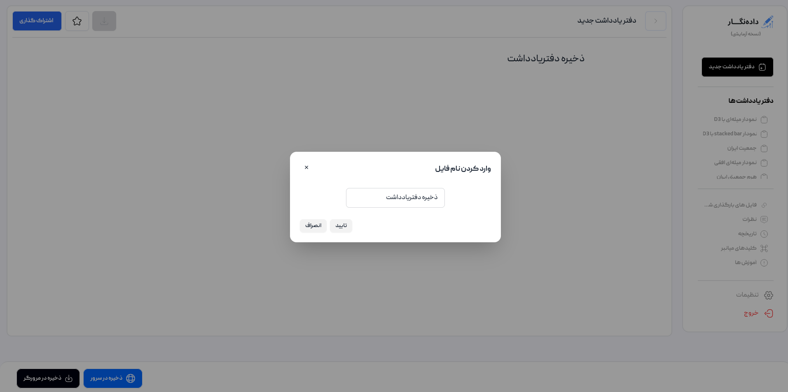

# راهنمای سایت
راهنمای استفاده از داده نگار

## ثبت نام
در حال حاضر برای استفاده از داده نگار نیازی به ثبت نام نمی‌باشد.

## ورود
برای ورود کافی است در یکی از سرویس‌های زیر نام کاربری داشته باشید و با استفاده از آن وارد داده نگار شوید:
- [گوگل](https://google.com)
- [گیت‌هاب](https://github.com)
- [گیت‌لب](https://gitlab.com)

<kbd></kbd>

## داشبورد :id=dashboard
با ورود به داده نگار وارد داشبورد کاربری خود می‌شوید.

<kbd></kbd>

داشبورد داده نگار شامل موارد زیر می‌باشد:
1. ایجاد دفتریادداشت جدید
2. بارگذاری دفتریادداشت
    - تنها دفتریادداشت‌هایی که از داده نگار خروجی گرفته شده‌اند قابلیت نمایش دارند. (قالب `json`)
3. راهنمای استفاده از داده نگار
4. آموزش کتابخانه‌های رسم نمودار
5. نمایش دفتریادداشت‌های اخیر
    - نمایش دفتریادداشت‌هایی که به تازگی ایجاد شده‌اند و یا به تازگی تغییراتی در آن‌ها داده شده است.
6. جستجوی دفتریادداشت‌ها
7. نمایش تمامی دفتریادداشت‌ها
8. تنظیمات (بزودی)
9. خروج از داده نگار
10. نام کاربری
11. مخزن گیت‌هاب
    - اگر گیت‌‌هاب را به عنوان ذخیره‌ساز معرفی کرده باشید، دفتریادداشت‌های موجود در یک مخزن در این بخش نمایش داده می‌شوند.
12. دفتریادداشت
    - نمایش عکس پیش‌نمایش دفتریادداشت
    - نام دفتریادداشت
    - زمان آخرین تغییرات
    - نمایش ذخیره‌ساز دفتریادداشت
    - با کلیک بر روی سه نقطه می‌توانید دفتریادداشت را حذف یا دانلود کنید.
13. نمایش همه دفتریادداشت‌ها

## صفحه دفتریادداشت‌ها :id=notebooksPage
شما در این صفحه می‌توانید به تمامی دفتریادداشت‌هایی که ایجاد کرده‌اید دسترسی داشته باشید.

<kbd></kbd>

1. داشبورد
2. ایجاد دفتریادداشت جدید
3. جستجوی دفتریادداشت‌ها
4. مخزن گیت‌هاب
    - اگر گیت‌‌هاب را به عنوان ذخیره‌ساز معرفی کرده باشید، دفتریادداشت‌های موجود در یک مخزن در این بخش نمایش داده می‌شوند.
5. دفتریادداشت
    - نمایش عکس پیش‌نمایش دفتریادداشت
    - نام دفتریادداشت
    - زمان آخرین تغییرات
    - نمایش ذخیره‌ساز دفتریادداشت
    - با کلیک بر روی سه نقطه می‌توانید دفتریادداشت را حذف یا دانلود کنید.

## دفتریادداشت جدید
زمانی که اقدام به ایجاد دفتریادداشت جدید می‌کنید، ابتدا باید محل ذخیره آن را مشخص کنید. در حال حاضر داده نگار امکان استفاده از سه ذخیره‌ساز را به شما می‌دهد:
1. دستگاه (حافظه مرورگر)
2. سرور (خود داده نگار)
3. گیت‌هاب

<kbd></kbd>

اگر گزینه «بعدا انتخاب می‌کنم» را بزنید، می‌توانید در زمان نخستین ذخیره‌سازی دفتریادداشت خود محل ذخیره آن را مشخص کنید.

> **مهم:** با انتخاب گزینه «بعدا انتخاب می‌کنم»، داده نگار دفتریادداشت شما را در هیچ ذخیره‌سازی ذخیره نمی‌کند و با بازنشانی (refresh) صفحه یا بستن مرورگر دفتریادداشت شما حذف خواهد شد.

با انتخاب ذخیره‌سازهای دستگاه و سرور وارد دفتریادداشت می‌شوید، اما با انتخاب ذخیره‌ساز گیت‌هاب باید مراحل بخش گیت‌هاب را طی کنید.

### گیت‌هاب (github)
برای ایجاد یک دفتریادداشت در گیت‌هاب باید یک مخزن (repository) داشته باشید و به داده نگار اجازه خواندن و نوشتن به آن مخزن را بدهید. مراحل این فرآیند به صورت زیر است:

1. ابتدا پیامی به شما نمایش داده می‌شود که برای ذخیره‌سازی در گیت‌هاب باید دسترسی خواند و نوشتن را به داده نگار بدهید.

      <kbd></kbd>

2. پس از دادن دسترسی به گیت‌هاب باید آدرس مخزن را وارد کنید. (نمونه: `https://github.com/username/repositoryName`)

      <kbd></kbd>

3. پس از دریافت اطلاعات مخزن شما توسط داده نگار، می‌توانید دفتریادداشت جدید استفاده کنید و یا به دفتریادداشت‌های موجود در مخزن دسترسی داشته باشید.

## دفتریادداشت
دفتریادداشت داده نگار شامل موارد زیر است:

<kbd></kbd>

1. [نام کاربری](#username)
2. [داشبورد](#dashboard)
3. [دفتریادداشت‌ها](#notebooksPage)
4. [گیت‌هاب](#notebookGithub)
5. [فایل‌های بارگذاری شده](#notebookFiles) (بزودی)
6. [نظرات](#notebookComment) (بزودی)
7. [تاریخچه](#notebookHistory) (بزودی)
8. [کلیدهای میانبر](#shortcutKeys)
9. [آموزش‌ها](#tutorial) (بزودی)
10. [خروج](#logout)
11. [منو](#menuNotebook)
12. [جستجو](#searchInNotebook)
13. [نشانه‌گذاری](#bookmarkNotebook) (بزودی)
14. [حذف](#deleteNotenook)
15. [اشتراک‌گذاری](#notebookSharing)
16. [نام دفتریادداشت](#notebookName)
17. [بلاک جدید](#newBlock)
18. [ذخیره دفتریادداشت](#saveNotebook)

### نام کاربری :id=username
نام کاربری شما با توجه به سرویسی که از آن برای ورود به داده نگار استفاده کرده‌اید نمایش داده می‌شود.

### گیت‌هاب :id=notebookGithub
اگر ذخیره‌ساز دفتریادداشت را گیت‌هاب انتخاب کرده باشید به این بخش دسترسی خواهید داشت. در این بخش لیست تمام دفتریادداشت‌های ذخیره شده در گیت‌هاب نمایش داده می‌شود.
- هر یک از دفتریادداشت‌ها به صورت یک فایل json در مخزن معرفی شده ذخیره می‌شود.

### فایل‌های بارگذاری شده :id=notebookFiles
این ویژگی در نسخه‌های آینده در دسترس قرار خواهد گرفت.

### نظرات :id=notebookComment
این ویژگی در نسخه‌های آینده در دسترس قرار خواهد گرفت.

### تاریخچه :id=notebookHistory
این ویژگی در نسخه‌های آینده در دسترس قرار خواهد گرفت.

### کلیدهای میانبر :id=shortcutKeys
با کلیک بر روی این بخش در پایین دفتریادداشت کلیدهای میانبر (shortcut) قابل استفاده در دفتریادداشت نمایش داده می‌شود.

### آموزش :id=tutorial
این ویژگی در نسخه‌های آینده در دسترس قرار خواهد گرفت.

### خروج :id=logout
برای خروج از داده نگار می‌توانید از این گزینه استفاده کنید. با کلیک بر روی خروج پیامی جهت تایید خروج نمایش داده می‌شود که با تایید آن از داده نگار خارج می‌شوید.

<kbd></kbd>

### منو :id=menuNotebook
در این بخش شما می‌توانید به منوهای دفتریادداشت دسترسی داشته باشید. هر یک از منوها شامل گزینه‌های متفاوتی است که به شرح زیر می‌باشند.

#### منوی فایل
1. دفتریادداشت جدید
    - این گزینه یک دفتریادداشت جدید ایجاد می‌کند.
2. بارگذرای دفتریادداشت
    - با انتخاب این گزینه می‌توانید فایل json یک دفتریادداشت را بارگذاری کنید.
3. بستن
    - این گزینه دفتریادداشتی را که در آن هستید بسته و شما را به صفحه [داشبورد](#dashboard) هدایت می‌کند.
4. بازکردن remote (غیرفعال)
5. ذخیره
    - این گزینه تغییرات اعمال شده در دفتریادداشت را ذخیره می‌کند.
6. ذخیره در
    - با استفاده از این گزینه می‌توانید محل ذخیره‌سازی دفتریادداشت را تغییر دهید.
7. قالب‌ها (غیرفعال)
8. اشتراک‌گذاری (غیرفعال)
9. چاپ کردن (غیرفعال)
10. خروجی
    - از این گزینه می‌توانید برای خروجی گرفتن از دفتریادداشت استفاده کنید. (در حال حاضر خروجی دفتریادداشت در قالب json می‌باشد.)

#### منوی ویرایش
در نسخه‌های آینده در دسترس قرار خواهد گرفت.

#### منوی نمایش
در نسخه‌های آینده در دسترس قرار خواهد گرفت.

#### منوی اضافه کردن
در نسخه‌های آینده در دسترس قرار خواهد گرفت.

#### منوی راهنما
در نسخه‌های آینده در دسترس قرار خواهد گرفت.

### جستجو :id=searchInNotebook
با وارد کردن یک نویسه یا حرف یا رشته در این فیلد، می‌توانید آن را در دفتریادداشت جستجو کنید.
- موارد منطبق با ورودی در دفتریادداشت برجسته (highlight) می‌شوند.

### نشانه‌گذاری :id=bookmarkNotebook
این ویژگی در نسخه‌های آینده در دسترس قرار خواهد گرفت.

### حذف :id=deleteNotenook
با استفاده از این گزینه می‌توانید دفتریادداشتی که در آن قرار دارید را حذف کنید.
- هنگام انتخاب این گزینه تاییدیه برای حذف دفتریادداشت از شما پرسیده خواهد شد در صورت تایید دفتریادداشت حذف می‌شود.

<kbd></kbd>

### اشتراک‌گذاری :id=notebookSharing
این ویژگی در نسخه‌های آینده در دسترس قرار خواهد گرفت.

### نام دفتریادداشت :id=notebookName
نام دفتریادداشت ایجاد شده در این بخش نمایش داده می‌شود. برای ویرایش نام دفتریادداشت کافی است بر روی نام دفتریادداشت کلیک کنید، پس از آن کادر ویراش نام فعال می‌شود و شما می‌توانید نام دفتریادداشت را ویرایش کنید.

> جهت ذخیره نام جدید حتما باید بر روی دکمه «ذخیره» کلیک کنید.

### بلاک‌های دفتریادداشت
دفتریادداشت داده نگار یک دفتریادداشت بلاکی است، بدین معنا که هر بلاک به صورت مستقل قابل تغییر و نوشتن است.

> در کنار هر بلاک (سمت چپ) بخش تنظیماتی وجود دارد که می‌توان با استفاده از آن کارهای زیر را انجام داد:
> - جابجایی بلاک به بالا یا پایین
> - حذف بلاک
> - راست چین، چپ چین و وسط چین کردن بلاک
> - تغییر جهت متن به راست یا چپ
> <kbd></kbd>

#### بلاک متن
برای ایجاد متن می‌توان از این بلاک استفاده کرد. با انتخاب هر بخش از متن ابزارکی نمایش داده می‌شود که می‌توان تغییرات زیر را در متن اعمال کرد.
- تبدیل متن به عنوان، لیست یا چک لیست
- پر رنگ کردن متن (bold)
- کج کردن متن (italic)
- ایجاد پیوند (link)
- زیرخط (undrline)
- کد (code)
- برجسته کردن (highlight)

<kbd></kbd>

#### بلاک عنوان
با استفاده از بلاک عنوان می‌توان انواع عنوان‌ها را ایجاد کرد. در بخش تنظیمات بلوک (سمت چپ) می‌توانید از بین عنوان‌های ۱ تا ۴ اندازه عنوان مورد نظر خود را انتخاب کنید.

با انتخاب هر بخش از عنوان ابزارکی نمایش داده می‌شود که شامل ویژگی‌های زیر است:
- تبدیل عنوان به متن، لیست یا چک لیست
- پر رنگ کردن عنوان (bold)
- کج کردن عنوان (italic)
- ایجاد پیوند (link)
- خط زیر عنوان (undrline)
- کد (code)
- نشانه گذاری (highlight)

<kbd></kbd>

#### بلاک بارگذاری فایل
با انتخاب این بلاک در ابتدا یک انتخاب‌گر فایل نمایش داده می‌شود که با استفاده از آن می‌توانید فایل خود را انتخاب کنید.

<kbd></kbd>

پس از بارگذاری فایل در دفتریادداشت، شما می‌توانید محتوای فایل خود را مشاهده کنید و با استفاده از متغییری که با نام فایل بارگذاری شده ایجاد شده است در بلاک ادیتور از داده‌های موجود در فایل استفاده کنید.

<kbd></kbd>

#### بلاک ویرایشگر کد

#### بلاک نمودار
در بلاک نمودار شاما می‌توانید با استفاده از کتابخانه‌های [D3](https://d3js.org) و [observableplot](https://observablehq.com/plot) نمودارهای مورد نظر خود را رسم کنید.

<kbd></kbd>

#### بلاک عکس
برای بارگذاری عکس در دفتریادداشت می‌توانید از بلاک عکس استفاده کنید. با انتخاب این بلاک پنجره‌ای برای انتخاب عکس مورد نظر باز می‌شود که پس از تایید، عکس مورد نظر به دفتریادداشت اضافه می‌شود.

<kbd></kbd>

بخش تنظیمات این بلاک شامل ویژگی‌های زیر است:
- اضافه کردن کادر
- کشیدن عکس
- اضافه کردن عکس پس‌زمینه
- عنوان عکس

#### بلاک جدول
با استفاده از بلاک جدول می‌توانید جدولی با تعداد سطرها و ستون‌های دلخواه ایجاد کنید. ای بلاک شامل ویژگی‌های زیر است:
- اضافه کردن ستون
- اضافه کردن سطر
- اضافه کردن عنوان

<kbd></kbd>

#### بلاک نقاشی
با استفاده از بلاک نقاشی می‌توانید هر طرحی که می‌خواهید با ماوس بکشید. این بلاک شامل ویژگی‌های زیر است:
- پاک کردن بخشی از نقش کشیده شده
- پاک کردن کل

<kbd></kbd>

#### بلاک جمع شونده

#### بلاک لیست
با استفاده از این بلاک می‌توانید لیست‌های مرتب و نامرتب ایجاد کنید. شما در بخش تنظیمات می‌توانید در هر زمان لیست‌های مرتب را به نامرتب و بالعکس تبدیل کنید.

با انتخاب هر بخش از متن لیست‌ها ابزارکی نمایش داده می‌شود که شامل ویژگی‌های زیر است:
- تبدیل لیست به متن، عنوان یا چک لیست
- پر رنگ کردن عنوان (bold)
- کج کردن عنوان (italic)
- ایجاد پیوند (link)
- خط زیر عنوان (undrline)
- کد (code)
- نشانه گذاری (highlight)

<kbd></kbd>

#### بلاک چک لیست
با استفاده از این بلاک می‌توانید چک لیست ایجاد کنید. با انتخاب هر بخش از متن چک لیست ابزارکی نمایش داده می‌شود که شامل ویژگی‌های زیر است:
- تبدیل چک لیست به متن، عنوان یا لیست
- پر رنگ کردن عنوان (bold)
- کج کردن عنوان (italic)
- ایجاد پیوند (link)
- خط زیر عنوان (undrline)
- کد (code)
- نشانه گذاری (highlight)

<kbd></kbd>

### ذخیره دفتریادداشت :id=saveNotebook
برای ذخیره سازی دفتریادداشت کافی است بر روی دکمه «ذخیره» کلیک کنید تا فرآیند ذخیره‌سازی آغاز شود.

> دقت کنید که با استفاده از گزینه ذخیره سازی در مرورگر، اطلاعات دفتر یادداشت شما در کش مرورگر ذخیره می‌شود و پاک کردن کش مربوط به داده نگار اطلاعات دفتریادداشت شما نیز پاک می‌شود.

> اگر برای دفتریادداشت خود نامی انتخاب نکرده باشید، با کلیک بر روی دکمه «ذخیره» پیامی مبنی بر انتخاب نام دفتریادداشت نمایش داده می‌شود که باید در آن نام مورد نظر خود را وارد کنید. پس از تایید نام دفتریادداشت فرآیند ذخیره‌سازی آغاز می‌شود.
<kbd></kbd>

> اگر گیت‌هاب را به عنوان ذخیره‌ساز انتخاب کرده باشید با هر بار ذخیره‌سازی داده نگار از شما می‌خواهد تا پیامی برای ثبت در گیت‌هاب (commit) وارد کنید. پس از آن فرآیند ذخیره‌سازی آغاز خواهد شد.
<kbd></kbd>