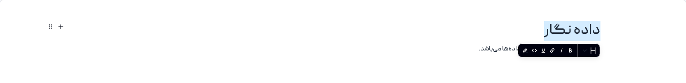

# راهنمای سایت
راهنمای استفاده از داده نگار

## ثبت نام
در حال حاضر برای استفاده از داده نگار نیازی به ثبت نام نمی‌باشد.

## ورود
برای ورود کافی است در یکی از سرویس‌های زیر نام کاربری داشته و با استفاده از آن وارد شوید:
* [گوگل](https://google.com)
* [گیت‌هاب](https://github.com)
* [گیت‌لب](https://gitlab.com)

## داشبورد
با ورود به داده نگار وارد داشبورد کاربری خود می‌شوید.

داشبورد داده نگار شامل موارد زیر می‌باشد:
1. ایجاد دفتریادداشت جدید
2. بارگذاری دفتریادداشت
    * تنها دفتریادداشت‌هایی که از داده نگار خروجی گرفته شده‌اند قابلیت نمایش دارند.
3. راهنمای استفاده از داده نگار
4. آموزش کتابخانه‌های رسم نمودار
5. تنظیم زبان
6. نمایش دفتریادداشت‌های اخیر
7. نمایش تمامی دفتریادداشت‌ها
8. خروج از داده نگار

## دفتریادداشت
دفتریادداشت داده نگار شامل موارد زیر است:

1. نام ایجاد کننده دفتریادداشت
2. تاریخ آخرین تغییر دفتریادداشت
3. اشتراک گذاری دفتر یادداشت
4. انتخاب بلاک
5. ابزار دفتر یادداشت
    * جستجو در دفتریادداشت
    * تاریخجه تغییرات
    * میانبرها
    * اطلاعات دفتریادداشت
6. ذخیره دفتریادداشت در سرور
7. ذخیره دفتریادداشت در مروگر
8. بازگشت به داشبورد
9. جستجو در کل دفتریادداشت‌ها
10. دریافت فایل دفتریادداشت
11. نشان کردن دفتریادداشت

## بلاک‌های دفتریادداشت
دفتریادداشت داده نگار یک دفتریادداشت بلاکی است، بدین معنا که هر بلاک به صورت مستقل قابل تغییر و نوشتن است.
* متن
* عنوان
* بارگذاری فایل
* ادیتور
* نمودار
* عکس
* جدول
* نقاشی
* جمع شونده
* لیست
* چک لیست

> در کنار هر بلاک (سمت چپ) بخش تنظیماتی وجود دارد که می‌توان با استفاده از آن کارهای زیر را انجام داد:
> * جابجایی بلاک به بالا یا پایین
> * حذف بلاک
> * راست چین، چپ چین و وسط چین کردن بلاک
> * تغییر جهت متن به راست یا چپ
> 

### بلاک متن
برای ایجاد متن می‌توان از این بلاک استفاده کرد. با انتخاب هر بخش از متن ابزارکی نمایش داده می‌شود که می‌توان تغییرات زیر را در متن اعمال کرد.
* تبدیل متن به عنوان، لیست یا چک لیست
* پر رنگ کردن متن (bold)
* کج کردن متن (italic)
* ایجاد پیوند (link)
* خط زیر متن (undrline)
* کد (code)
* نشانه گذاری (highlight)

### بلاک عنوان
با استفاده از بلاک عنوان می‌توان انواع عنوان‌ها را ایجاد کرد. در بخش تنظیمات بلوک (سمت چپ) می‌توانید از بین عنوان‌های ۱ تا ۴ اندازه عنوان مورد نظر خود را انتخاب کنید.

با انتخاب هر بخش از عنوان ابزارکی نمایش داده می‌شود که شامل ویژگی‌های زیر است:
* تبدیل عنوان به متن، لیست یا چک لیست
* پر رنگ کردن عنوان (bold)
* کج کردن عنوان (italic)
* ایجاد پیوند (link)
* خط زیر عنوان (undrline)
* کد (code)
* نشانه گذاری (highlight)

### بلاک بارگذاری فایل
با انتخاب این بلاک در ابتدا یک انتخاب‌گر فایل نمایش داده می‌شود که با استفاده از آن می‌توانید فایل خود را انتخاب کنید.

پس از بارگذاری فایل در دفتریادداشت، شما می‌توانید محتوای فایل خود را مشاهده کنید و با استفاده از متغییری که با نام فایل بارگذاری شده ایجاد شده است در بلاک ادیتور از داده‌های موجود در فایل استفاده کنید.

### بلاک ادیتور

### بلاک نمودار
در بلاک نمودار شاما می‌توانید با استفاده از کتابخانه‌های [D3](https://d3js.org) و [observableplot](https://observablehq.com/plot) نمودارهای مورد نظر خود را رسم کنید.

### بلاک عکس
برای بارگذاری عکس در دفتریادداشت می‌توانید از بلاک عکس استفاده کنید. با انتخاب این بلاک پنجره‌ای برای انتخاب عکس مورد نظر باز می‌شود که پس از تایید، عکس مورد نظر به دفتریادداشت اضافه می‌شود.

بخش تنظیمات این بلاک شامل ویژگی‌های زیر است:
* اضافه کردن کادر
* کشیدن عکس
* اضافه کردن عکس پس‌زمینه
* عنوان عکس

### بلاک جدول
با استفاده از بلاک جدول می‌توانید جدولی با تعداد سطرها و ستون‌های دلخواه ایجاد کنید. ای بلاک شامل ویژگی‌های زیر است:
* اضافه کردن ستون
* اضافه کردن سطر
* اضافه کردن عنوان

### بلاک نقاشی
با استفاده از بلاک نقاشی می‌توانید هر طرحی که می‌خواهید با ماوس بکشید. این بلاک شامل ویژگی‌های زیر است:
* پاک کردن بخشی از نقش کشیده شده
* پاک کردن کل

### بلاک جمع شونده

### بلاک لیست
با استفاده از این بلاک می‌توانید لیست‌های مرتب و نامرتب ایجاد کنید. شما در بخش تنظیمات می‌توانید در هر زمان لیست‌های مرتب را به نامرتب و بالعکس تبدیل کنید.

با انتخاب هر بخش از متن لیست‌ها ابزارکی نمایش داده می‌شود که شامل ویژگی‌های زیر است:
* تبدیل لیست به متن، عنوان یا چک لیست
* پر رنگ کردن عنوان (bold)
* کج کردن عنوان (italic)
* ایجاد پیوند (link)
* خط زیر عنوان (undrline)
* کد (code)
* نشانه گذاری (highlight)

### بلاک چک لیست
با استفاده از این بلاک می‌توانید چک لیست ایجاد کنید. با انتخاب هر بخش از متن چک لیست ابزارکی نمایش داده می‌شود که شامل ویژگی‌های زیر است:
* تبدیل چک لیست به متن، عنوان یا لیست
* پر رنگ کردن عنوان (bold)
* کج کردن عنوان (italic)
* ایجاد پیوند (link)
* خط زیر عنوان (undrline)
* کد (code)
* نشانه گذاری (highlight)

